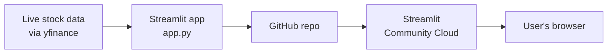
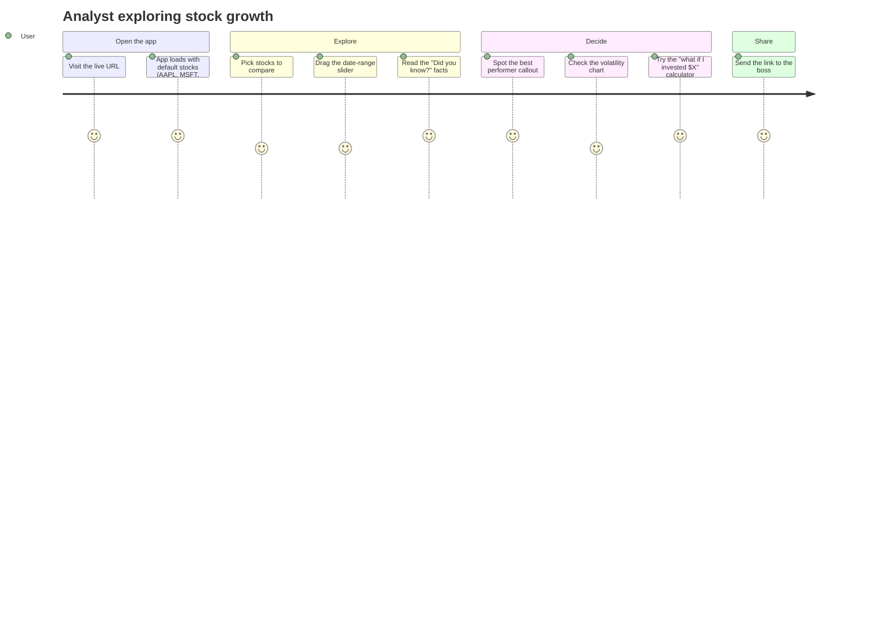

# 📈 Stock Price Explorer

A simple Streamlit app for comparing how the big tech stocks (AAPL, MSFT, GOOG, AMZN, META, NFLX) have grown since January 2018, using live data updated daily.

**Live app:** _add your Streamlit Cloud URL here_

## Features

- Pick any combination of stocks to compare
- Date-range slider to zoom into a specific period
- Growth metrics (x-multiple and %) per stock, normalized to the start of the selected range
- 🏆 Automatic "best performer" callout
- 📊 Bar chart of total growth by stock
- 🌪️ Volatility indicator — which stock bounced around the most
- 💸 "What if I invested $X?" calculator
- 💡 Real-world "Did you know?" facts about Apple and Netflix

## Architecture



The app fetches live daily stock prices at runtime with `yfinance` (cached for a day via `@st.cache_data`), so the data is always current through today — no static file to maintain. The code lives in a public GitHub repo, which Streamlit Community Cloud watches and deploys automatically on every push.

### User journey



## Running locally

```bash
pip install -r requirements.txt
streamlit run app.py
```

## Tech stack

- [Streamlit](https://streamlit.io/) — web UI
- [Plotly](https://plotly.com/python/) — charts
- [yfinance](https://github.com/ranaroussi/yfinance) — live stock price data
- [pandas](https://pandas.pydata.org/) — data wrangling
